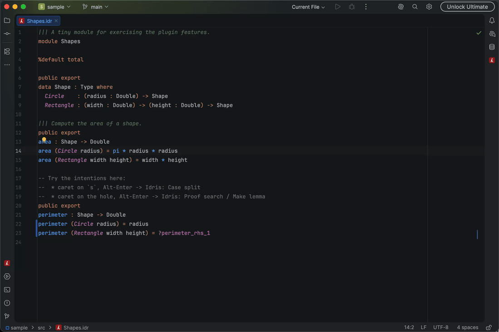

# Idris 2 (JVM) — IntelliJ Plugin

IntelliJ IDEA support for [Idris 2](https://www.idris-lang.org/), talking
directly to the compiler's IDE-mode protocol. Built for (and tested against)
the [JVM backend](https://github.com/mmhelloworld/idris-jvm), but works with
any `idris2` build that speaks ide-mode protocol version 2.

## Features

- Syntax highlighting: instant lexical highlighting plus the compiler's own
  semantic highlighting (types, functions, data constructors, bound variables)
  after each successful load
- Compiler diagnostics with precise spans, refreshed when the file is saved;
  build progress is shown in the status bar, and long first-time builds are
  fine — the compiler session only times out after sustained silence (idle
  timeout), not on total duration
- Quick documentation (type-at-point via `:type-of`, docs via `:docs-for`)
- Go-to-definition across modules (semantic cache + `:name-at`)
- Code completion backed by `:repl-completions`
- Type-driven interactive editing via Alt-Enter intentions:
  case split, add clause, proof search (with "next solution" cycling),
  generate definition (also cyclable), make lemma, make case, make with,
  introduce constructor, refine hole with an expression
- Holes tool window listing each hole's type and context, refreshed on every
  load; double-click navigates to the hole
- Idris REPL tool window multiplexed over the same compiler session
- Literate Idris (`.lidr`, bird-track style) with prose-aware highlighting

Known limitation: the ide-mode protocol has no rename and no position-based
find-references, so those are not offered.

## Feature tour

Compiler diagnostics with precise spans, refreshed on save — including the
compiler's "did you mean" hints on hover:

Quick documentation (type-at-point) on the symbol under the caret:

Go-to-definition across modules:

Code completion backed by the compiler's `:repl-completions`:

Type-driven editing with Alt-Enter intentions — case split on a pattern
variable:

…and proof search to fill a hole:

The Holes tool window lists each hole with its type and context; double-click
jumps to the hole:

An Idris REPL multiplexed over the same compiler session:

## Setup

1. Install the plugin, then set the `idris2` executable under
   **Settings | Languages & Frameworks | Idris 2**. For the JVM backend point
   it at `<idris-jvm>/exec/idris2` (release zip) or
   `<idris-jvm>/build/exec/idris2` (source build). `JAVA_OPTS` is honored by
   that launcher script. **JVM backend builds must be 0.8.3 or newer**
   (available from
   [GitHub releases](https://github.com/mmhelloworld/idris-jvm/releases) and
   Maven Central) — older JVM builds have a blocking-`fEOF` runtime bug that
   stalls ide-mode replies (see docs/PROTOCOL.md), and the plugin refuses to
   start against them; Scheme-built compilers of any version are fine.
2. Open any project containing `.idr` files. The plugin spawns one
   `idris2 --ide-mode` process per `.ipkg` root (falling back to the content
   root) and loads files as you open/save them.

## Development

- `./gradlew build` — build + unit tests (protocol codec, fake-server
  connection tests, lexer)
- `IDRIS2_EXEC=/path/to/idris2 ./gradlew test` — additionally runs integration
  tests against a real compiler
- `./gradlew runIde` — launch a sandbox IDE (2024.2, the oldest supported
  platform); open the `sample/` project
- `./gradlew runIdeLatest` — same, but on the newest IntelliJ IDEA (2026.1;
  the unified distribution that replaced IDEA Community since 2025.3)
- `./gradlew verifyPlugin` — plugin verifier

The wire-protocol notes shared with future clients (VS Code) live in
[docs/PROTOCOL.md](docs/PROTOCOL.md). The `protocol/` package has no IntelliJ
dependencies by design.
